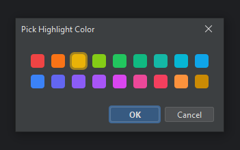
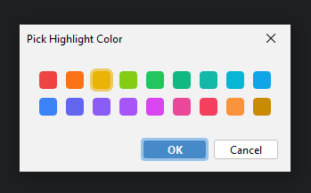

# Swing Minimal Color Picker

A Java Swing color picker built with FlatLaf and MigLayout. Forked from https://github.com/DJ-Raven/swing-color-picker 
and minimised to <300 LoC. Made the selected colour highlight persist





## Usage

#### Show with Dialog

``` java
Color color = ColorPicker.showDialog(this, "Pick Highlight Color", new SimpleColorPicker());

if (color != null) {
    // color selected
}
```

## Library Resources

- [FlatLaf](https://github.com/JFormDesigner/FlatLaf) - FlatLaf library for the modern UI design theme
- [MigLayout](https://github.com/mikaelgrev/miglayout) - MigLayout library for flexible layout management
