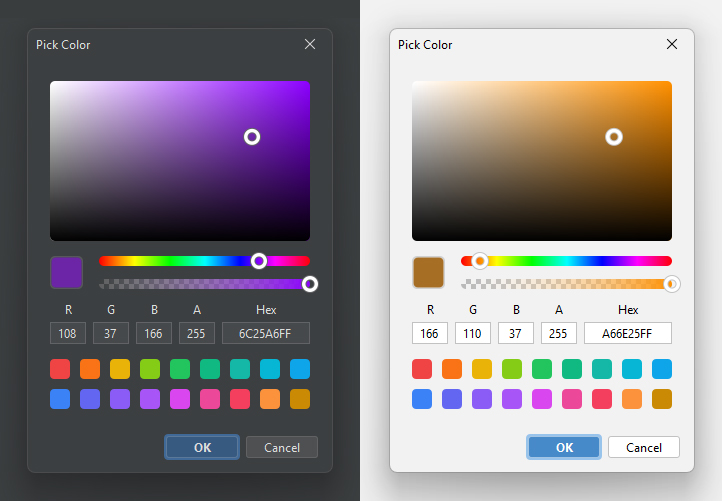

# Swing Color Picker

A Java Swing color picker built with FlatLaf and MigLayout.

&nbsp;

## Installation

Not yet released — only snapshot versions are available.

### Snapshots

To get the latest updates before the release, you can use the snapshot version
from [Sonatype Central](https://central.sonatype.com/service/rest/repository/browse/maven-snapshots/io/github/dj-raven/swing-color-picker/)

``` xml
<repositories>
    <repository>
        <name>Central Portal Snapshots</name>
        <id>central-portal-snapshots</id>
        <url>https://central.sonatype.com/repository/maven-snapshots/</url>
    </repository>
</repositories>
```

Add the snapshot version

``` xml
<dependency>
    <groupId>io.github.dj-raven</groupId>
    <artifactId>swing-color-picker</artifactId>
    <version>1.0.0-SNAPSHOT</version>
</dependency>
```

## Usage

``` java
// create color picker object
ColorPicker colorPicker = new ColorPicker();

// create event color changed

colorPicker.addColorChangedListener((color, event) -> {
    // color changed
});

```

#### Show with Dialog

``` java
Color color = ColorPicker.showDialog(this, "Pick Color", null);

if (color != null) {
    // color selected
}
```

## Library Resources

- [FlatLaf](https://github.com/JFormDesigner/FlatLaf) - FlatLaf library for the modern UI design theme
- [MigLayout](https://github.com/mikaelgrev/miglayout) - MigLayout library for flexible layout management
